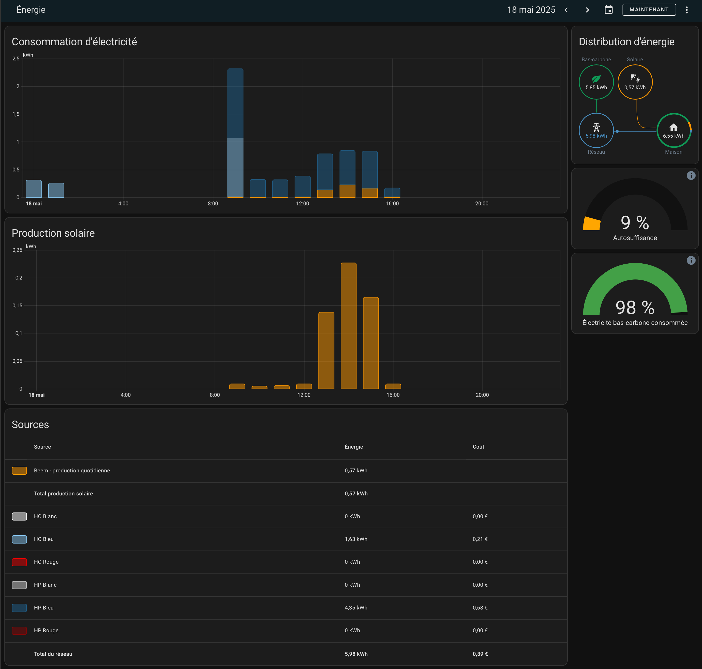

  <h3 align="center">How to customize the colors of your energy dashboard on Home Assistant ?</h3>
</div>

### Built With

* 

<!-- GETTING STARTED -->
## GETTING STARTED

Here we are based on a french electricity contract named "Tempo", which allow 3 colors and 6 options (high or low price for each color).

### 1. Create a "themes" folder

In your File Editor, add a new folder named "themes" in your home assistant.

### 2. Create a "theme_tempo.yaml" file

In your new "Themes" folder, add a new file named "theme_tempo.yaml" : 

  ```sh
theme_tempo:
# Pouvoir choisir entre un thème sombres et clair
  primary-color: coral
  modes:
    light:
      secondary-text-color: olive
    dark:
      secondary-text-color: slategray
          
# Couleurs personnalisées pour les sources d'énergie
  # Jour blanc HC : 
  energy-grid-consumption-color-0: "#fff"
  # Jour bleu HC :
  energy-grid-consumption-color-1: "#85C1E9"
  # Jour rouge HC : 
  energy-grid-consumption-color-2: "#E60000"
  # Jour blanc HP :
  energy-grid-consumption-color-3: "#cccccc"
  # Jour bleu HP :
  energy-grid-consumption-color-4: "#21618C"
  # Jour rouge HP : 
  energy-grid-consumption-color-5: "#850606"
  # Standard : Tarif Base
  energy-grid-consumption-color-6: "#9eb75c"
  ```

### 3. Edit your configuration.yaml

In this file, in order to see the changes, you should write :
```
# Load frontend themes from the themes folder
frontend:
  themes: !include_dir_merge_named themes
```

### 4. Check the configuration :

On the Developpment tools, check your configuration. If everything is okay, juste restart your Home Assistant.

### 5. Apply the theme :

Select your profile, then you can choose your theme and if you prefer dark or light mode.

<!-- USAGE EXAMPLES -->
## Usage

<a href="https://github.com/ClaraVnk/home-assistant-custom-energy-dashboard">
    
  </a>

<!-- CONTRIBUTING -->
## Contributing

Contributions are what make the open source community such an amazing place to learn, inspire, and create. Any contributions you make are **greatly appreciated**.

If you have a suggestion that would make this better, please fork the repo and create a pull request. You can also simply open an issue with the tag "enhancement".
Don't forget to give the project a star! Thanks again!

<!-- ACKNOWLEDGMENTS -->
## Acknowledgments

This is based on @zatoufly 's work (available on Github https://github.com/zatoufly)
